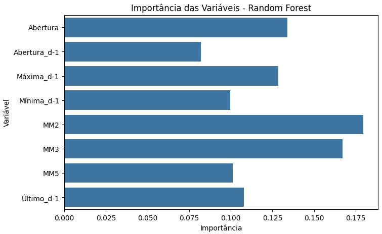

# Apresentação do Projeto: Previsão do Ibovespa

---

## 🎤 1º Integrante – Introdução e Objetivo do Projeto (1 min)

"Olá! Neste projeto, analisamos o comportamento diário do Ibovespa nos últimos 3 anos, com o objetivo de prever se o índice fechará em alta ou queda no próximo dia. Para isso, usamos modelos de inteligência artificial e técnicas de aprendizado de máquina, comparando principalmente dois algoritmos: Regressão Logística e Random Forest.

Nosso foco foi entender se é possível prever o mercado com base em padrões anteriores e quais variáveis mais influenciam essa previsão."

---

## 🎤 2º Integrante – Metodologia e Modelos Testados (1 min)

"Primeiro, tratamos e transformamos os dados para facilitar a análise: convertendo datas, formatando os preços e criando indicadores como médias móveis e variáveis de dias anteriores, que ajudam a capturar tendências do mercado.

Depois, dividimos os dados: usamos a maior parte para treino e deixamos os últimos 30 dias como teste, simulando uma previsão real.

Testamos dois modelos principais:
- Regressão Logística, um modelo mais simples e estatístico, e
- Random Forest, um modelo mais complexo e robusto, baseado em várias árvores de decisão."

---

## 🎤 3º Integrante – Resultados e Interpretação (Regressão Logística) (1 min)

"A Regressão Logística apresentou 83% de acurácia, acertando 25 dos 30 dias previstos. Analisando a matriz de confusão, o modelo teve um bom equilíbrio entre acertos de altas e quedas, cometendo poucos erros. Com dados escalonados, houve uma leve melhora no desempenho.

|  |  |
|--------------------------------------------|--------------------------------------------|

Isso mostra que o modelo é confiável e consistente para prever o movimento diário do Ibovespa, auxiliando decisões no mercado."

---

## 🎤 4º Integrante – Resultados e Interpretação (Random Forest) (1 min)

"O Random Forest teve desempenho inferior, com 40% de acerto, possivelmente por underfitting e eventos atípicos nos últimos 30 dias. Apesar disso, ele destacou as variáveis mais relevantes para a previsão, como:

- Média Móvel de 2 dias (MM2)
- Média Móvel de 3 dias (MM3)
- Abertura do dia atual
- Indicadores do dia anterior

A Curva ROC indicou baixa capacidade do modelo em distinguir altas e quedas (AUC 0,52), mostrando que o Random Forest não captou padrões claros, mas ajudou a identificar variáveis importantes para futuras melhorias."

---

## 🎤 Todos (ou 5º Integrante) – Conclusão e Recomendação (1 min)

"Com base nos testes e nos resultados, recomendamos o uso da Regressão Logística como modelo principal para previsões diárias do Ibovespa.

Ela se mostrou mais estável, precisa e fácil de interpretar, especialmente em contextos com pouco histórico recente, como em operações diárias.

Já o Random Forest pode ser útil em análises mais aprofundadas e com maior volume de dados.

Obrigado por assistir à nossa apresentação!"
